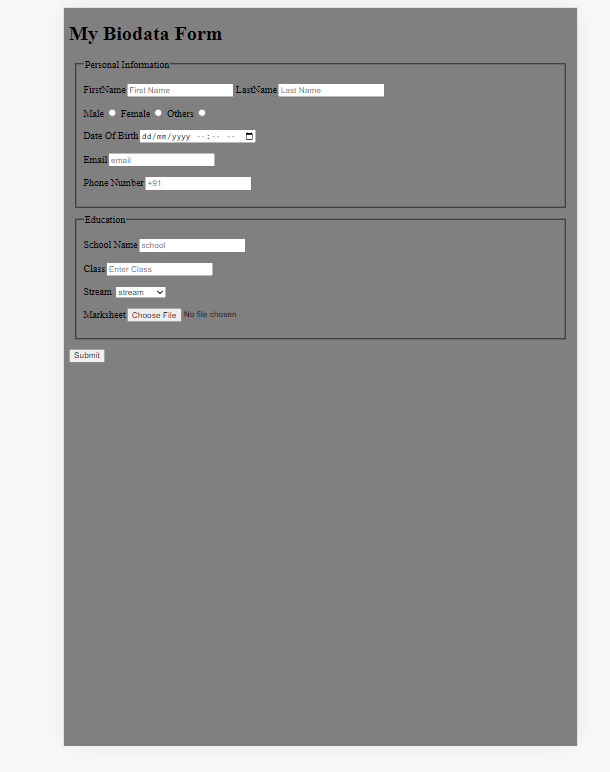

# BASIC FORM PRACTISE

## AN AGENCY FORM FILLING PAGE

## Welcome back!!!

##let's get started.

Thank you for checking this work.

## About This Work:

This work is created for the purpose of practising and revising forms in (HTML & CSS) with right and well measured web units and adequate sizing for the purpose of ensuring effective layout of website, and other HTML templates.

## pictures of this Work

##An Example##
##Collective collections##

##process##
THIS FILE IS FOR THE PRACTISE OF HTML(BASIC)
-PRACTISE FOR THE BUILDING OF MODERN SEMANTIC WEBSITE
-PRACTISED THE USE OF PROPER MARKNG-UP FOR BETTER RESULTS WITHIN A SHORT PEROID OF TIME.
-PRACTISED HOW TO STRUCTURE A MODERN FORM, AND ALSO ADDITION OF THE RIGHT FORM ATTRIBUTES FOR BETTER DESCRIPTIVE FORMS.

THIS FILE IS FOR THE PRACTISE OF CSS

-PRACTISED USING BORDERS, WIDTH WITH OTHER SPACING UTILITIES TO ENSURE A SMOOTH USAGE.
-USED FLEXBOX TO CONTROL THE DISPLAY PATTERN TOO.
-IT'S ALSO RESPONSVE......

##Larger screen sizes##

##smaller screen sizes##

## Built with

      -HTML(Hypertext Mark-up Language)
      -CSS(Cascading Styles Sheet)

## My Challanges and lessons

Learnt how to how to use the right input units for the form and better form accessibility building. HTML and CSS was fun working with.

## Installations

-For those Farmiliar with Git-hub you can clone the repo and pull to your local workplace to view.

-For those who want to check the work from the site, click here [https://chukwuma5.github.io/survey-form/], to view Thank you once again.

-For those who want to view the file through drop box, click here [https://www.dropbox.com/sh/dq3cjxdx7kpkaub/AAAbv6a4y0PjqT9ZZ-8QBpqMa?dl=0], to view Thank you once again.

-For those who want to view the file through git-hub, click here [https://github.com/chukwuma5/survey-form], to view Thank you once again.

## Best syntax Used

    ``CSS

spacing utilities(margin, padding)and (flex-box).
spacing utilities is very important in the layout of forms,to improve it's accessibility and structure
``

## Resources that helped

-For the Colors[https://htmlcolorcodes.com/color-names/]

-For the icons[https://fontawesome.com/v5.15/icons/instagram?style=brands] and svg's in the folder.

-For the images, you can use 1.[https://unsplash.com/]

-For the images, you can use 2.[https://pixabay.com/]

-for the image editing, you can use[https://photoscape.org]

## Licsense

This work is under [MIT] liscence. It's highly free and opensource to anyone.
